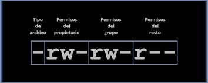

# Comandos Linux

## Comandos para trabajar desde la ubicaciòn.
- **man** Comando permite invocar los manuales en los    diferentes comandos.
    ```bash
    $ man date 
    ```
- **ls -a** Listar todos los directorios incluyendo los ocultos.
    ```bash
    $ ls -a 
    ```
- **ls -t** Ordena archivos por fecha de modificaciòn.
    ```bash
    $ ls -t 
    ```
- **ls -x** Ordena archivos por nombre (1) y extenciòn (2).
    ```bash
    $ ls -x 
    ```
- **ls -R** Muestra directorios de forma recursiva.
    ```bash
    $ ls -R 
    ```
## Comandos para mover o copiar

- **cp** Copia un archivo a un directorio.
    ```bash
    $ cp [archivo a copiar] [/ruta directorio a copiar]
    ```
- **mv** Mueve un archivo de ruta.
    ```bash
    $ mv [archivo a mover ] [/ruta directorio a mover]
    ```
- **rmdir** Elimina un directorio
    ```bash
    $ rmdir [ruta / directorio a eliminar]
    ```
- **ln -s** Comando para crear un acceso directo en la terminal
    ```bash
    $ ln -s [target_directory_path] [linked_directory_name_path]
    ```
___

## Utilizades batch 

- **cat** Muestra el contenido completo de un archivo.
    ```bash
    $ cat texto.txt
    ```
- **head** Muestra las primeras lienas del archivo o limitarlas con [-n#]
    ```bash
    $ head texto.txt
    $ head -n 5 texto.txt
    ```
- **tail** Muestra las ultimas lienas del archivo o limitarlas con [-n#].
    ```bash
    $ tail texto.txt
    $ tail -n 5 texto.txt
    ```
- **grep** Permite hacer busquedas con expresiones regulares.
    ```bash
    $ grep palabra clave archivo.txt
    $ grep -i pAlaBra cLaVe archivo.txt
    $ grep palabra clave$ archivo.txt
    $ grep ^palabra clave archivo.txt
    ```
## Utilizades procesos

- **&** Sirve para enviar el proceso a un segundo plano.
    ```bash
    $ mysql -h 127.0.0.1 -u root -p1234 < dump-sql &
    ```
- **ctrl z** Sirve para enviar un proceso al background del sistema.
- **fg** Sirve para retomar el proceso enviado a background.
- **ps** permite revisar los procesos del sistema.
- **ps ax** permite ver los procesos activos del sistema.
- **top** muestra el estado del sistema.
- **kill** Envia señales a los procesos para terminarlos.
- **kill -9** Envia señal de cortar inmediatamente.
- **killall archivoejecutable** Envia señal de cortar inmediatamente.

## Permisos sobre archivos.

- **ls -l** Comando que permite visualizar los privigelios de los archivos.
<p align="center"> </p>

- Dueño {rwx} Grupos {rwx} Otros {rwx}
    - r=Lectura
    - w=Escritura
    - x=Ejecucion

    ```bash
        $ rw-rw-r-- 1 usuario usuario 2318 feb 26 17:45 README.md
    ```

## Modificacion de Permisos.

- **chmod** Cambia permisos de lectura escritura y ejecucion al archivo teniendo en cuenta el usuario - grupo y otros.
    ```bash
        # Añadir permisos de ejecucion al usuario 
        $ chmod u+x nuevo.txt
        # Añadir permisos de escritura al grupo.
        $ chmod g+w nuevo.txt
        # Añadir permisos de escritura a otros.
        $ chmod o+w nuevo.txt
        # Añadir permisos de ejecucion a todos (cualquier usuario).
        $ chmod a+x nuevo.txt
        # Añadir permisos usando el esquema binario(-=0 x=1 w=2 r=4).
            # Permisos del usuario propietario: r (4) + w (2) + x (1) = 7.
            # Permisos del grupo al que pertenece el archivo: r (4) + x (1) = 5.
            #Permisos del grupo al que pertenece el archivo: r (4) = 4.
        $ chmod 754 hello.php
    ```
- **chown** Cambia quien el es usuario propietario del archivo.
    ```bash
            # Cambiando el usuario propietario
            $ sudo chown nuevo-usuario archivo.txt
            # Cambiando el grupo propietario
            $ sudo chown nuevo-grupo archivo.txt
            # Cambiando el usuario y grupo propietario
            $ sudo chown nuevo-usuario:nuevo-grupo archivo.txt
        ```
- **chgrp** Cambia quien es el grupo de usuarios que puede acceder 

## Compresion de Archivos.

- **gizp** Comando para comprimir los archivos.
    ```bash
            # Comprimiendo el archivo.
            $ gzip archivo.txt
            # Descomprimiendo el archivo.
            $ gzip -d archivo.txt.gz
    ```
- **tar** permite agrupar varios archivos en un grupo 
    ```bash
            # Agrupando archivos de la carpeta backup
            $ tar cf backup.tar backup/*
            # Revisando el contenido de backup.tar
            $ tar tf backup.tar
            # Descomprimir el contenido de backup.tar
            $ tar xf backup.tar
            # agrupar y comprimir todos los archivos de la carpeta backup.
            $ tar czf backup.tgz backup/*
            # Des-agrupar y des-comprimir todos los archivos de la carpeta backup.
            $ tar xzf backup.tgz
    ```
## Busqueda de archivos.
- **locate** Permite hacer una busqueda de un archivo en todo el sistema.
    ```bash
            # Buscarndo archivo en el sistema
            $ locate hello.php
    ```
- **find** Busca archivos en el sistema con diferentes argumentos
    ```bash
            # Buscarndo un archivo con usuario y permisos 644
            $ find . -user usuario -perm 644
            # Buscarndo solo archivos modificados (-type) en un tiempo mayor a 7 dias.
            $ find . -type f -mtime +7
            # Buscarndo archivos modificados (-type) en un tiempo mayor a 7 dias y moviendo el resultado a una carpeta backup.
            $ find . -type f -mtime +7 -exec cp {} ./backup/ \;
    ```
## Comandos HTTP
- **curl** Se usa para hacer pedidos hacia un servidor y se genera una respuesta.
    ```bash
            # Realizando peticion a url
            $ curl https://platzi.com
            # Realizando peticion a url con la opcion -v muestra toda a comunicacion http
            $ curl -v https://platzi.com
            # Realizando peticion a url con opcion -v muestra toda la comunicacion http y solo encabezados redireccionando la salida estandard a un espacio null
            $ curl -v https://platzi.com > /dev/null

    ```

- **wget** Se usa para hacer pedidos hacia un servidor y se genera una respuesta adicionalmente esta peticion permite hacer descargas.
    ```bash
            # Realizando una descarga del producto elasticsearch usan wget.
            $ wget https://artifacts.elastic.co/downloads/elasticsearch/elasticsearch-7.11.1-linux-x86_64.tar.gz
    ```

## Acceso Seguro a otras terminales.

- **ssh** Es un comando que permite conectar en forma segura a otra terminal, los parametros son los siguientes ssh {usuario}@{host destino} 


### Trucos.
- **Enviar correos @ a traves de la consola**
    ```bash
            # Enviando un mensaje de correo por consola
            $ echo "probando" | mail -s "Probando mensaje" destinatario@correo.com
    ```

---
Author
- Oscar Giovanni Bocanegra
- https://www.linkedin.com/in/oscarbocanegra/

___
Fuentes.
- [Platzi](https://platzi.com/)
    - Curso Intoduccion linea de comandos
    - Blog [Domina la Administración de Usuarios y Permisos en Servidores Linux](https://platzi.com/blog/administracion-usuarios-servidores-linux/)
